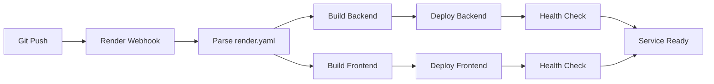

# Deployment Summary - Brain Training

## Созданные файлы для деплоя

### Основные конфигурационные файлы

| Файл | Назначение | Статус |
|------|------------|--------|
| `render.yaml` | Blueprint для автоматического создания сервисов в Render | ✅ Готов |
| `docker-compose.yml` | Локальное тестирование полного стека | ✅ Готов |
| `backend/Dockerfile` | Производственный образ Backend (FastAPI) | ✅ Готов |
| `frontend/Dockerfile` | Производственный образ Frontend (React + Nginx) | ✅ Готов |
| `frontend/nginx.conf` | Конфигурация Nginx для раздачи статики | ✅ Готов |

### Вспомогательные файлы

| Файл | Назначение | Статус |
|------|------------|--------|
| `backend/.dockerignore` | Исключения для Docker сборки (Backend) | ✅ Готов |
| `frontend/.dockerignore` | Исключения для Docker сборки (Frontend) | ✅ Готов |
| `frontend/public/env-config.js` | Runtime конфигурация для Docker | ✅ Готов |

### Документация

| Файл | Назначение | Статус |
|------|------------|--------|
| `DEPLOYMENT.md` | Полное руководство по деплою (15+ страниц) | ✅ Готов |
| `DEPLOYMENT_QUICKSTART.md` | Быстрый старт (5 минут) | ✅ Готов |
| `RENDER_ENV_VARS.md` | Справочник переменных окружения | ✅ Готов |
| `DOCKER_COMMANDS.md` | Справочник Docker команд | ✅ Готов |
| `DEPLOYMENT_SUMMARY.md` | Этот файл (сводка) | ✅ Готов |

---

## Измененные файлы

| Файл | Изменения | Причина |
|------|-----------|---------|
| `frontend/index.html` | Добавлен `<script src="/env-config.js">` | Runtime конфигурация для Docker |
| `frontend/src/services/api.ts` | Поддержка `window.ENV` переменных | Runtime конфигурация API_URL |
| `.gitignore` | Добавлены Docker и тестовые файлы | Исключить из git |

---

## Архитектура деплоя

```
┌─────────────────────────────────────────────────────────────────┐
│                         Render.com Cloud                        │
├─────────────────────────────┬───────────────────────────────────┤
│  Frontend Web Service       │   Backend Web Service             │
│  ┌───────────────────────┐  │   ┌───────────────────────────┐  │
│  │ Nginx (Alpine Linux)  │  │   │ Python 3.11 (Slim)        │  │
│  │ - Serve static files  │  │   │ - FastAPI + Uvicorn       │  │
│  │ - React build (dist/) │  │   │ - SQLAlchemy (async)      │  │
│  │ - Port: 80            │  │   │ - SQLite + aiosqlite      │  │
│  │                       │  │   │ - Port: 8000              │  │
│  │ Health: /health       │  │   │ Health: /health           │  │
│  └───────────────────────┘  │   └───────────────────────────┘  │
│           ▲                 │              ▲                    │
│           │                 │              │                    │
│    API_URL env var ─────────┼──────────────┘                    │
│                             │                                   │
└─────────────────────────────┴───────────────────────────────────┘
```

---

## Docker образы

### Backend Image

**Базовый образ:** `python:3.11-slim`
**Финальный размер:** ~200-250 MB (после оптимизации)

**Слои:**
1. Builder stage - установка зависимостей
2. Runtime stage - копирование зависимостей + код приложения
3. Инициализация БД через `seed_data.py`
4. Запуск Uvicorn на порту `$PORT`

**Ключевые особенности:**
- Multi-stage build для уменьшения размера
- SQLite база хранится в `/app/data` volume
- Автоматическое создание и наполнение БД при старте

### Frontend Image

**Базовый образ:** `node:20-slim` (builder) + `nginx:alpine` (runtime)
**Финальный размер:** ~25-30 MB

**Слои:**
1. Builder stage - npm install + Vite build
2. Runtime stage - Nginx + статические файлы
3. Custom nginx.conf для React Router
4. Runtime injection `env-config.js` через entrypoint

**Ключевые особенности:**
- Multi-stage build (значительно меньше размер)
- Nginx для эффективной раздачи статики
- Gzip compression для оптимизации передачи
- Security headers (X-Frame-Options, X-Content-Type-Options)

---

## Переменные окружения

### Backend (обязательные)

```
PORT=8000
DATABASE_URL=sqlite+aiosqlite:///./data/brain_training.db
```

### Frontend (обязательные)

```
API_URL=https://brain-training-api.onrender.com
```

**ВАЖНО:** После первого деплоя обновите `API_URL` на реальный URL backend сервиса!

---

## Deployment Flow

### Автоматический (Blueprint)



### Шаги:

1. Push в Git репозиторий
2. Render webhook триггерит деплой
3. Render парсит `render.yaml`
4. Параллельно собирает Backend и Frontend Docker образы
5. Деплоит на инфраструктуру Render
6. Выполняет health checks
7. Сервисы становятся доступны по HTTPS URL

**Время деплоя:** 7-10 минут (первый раз), 3-5 минут (последующие)

---

## Health Checks

### Backend

```bash
curl https://brain-training-api.onrender.com/health
# Response: {"status":"ok"}
```

**Endpoint:** `/health`
**Expected:** HTTP 200 + JSON {"status":"ok"}
**Interval:** 30 seconds

### Frontend

```bash
curl https://brain-training-frontend.onrender.com/health
# Response: healthy
```

**Endpoint:** `/health`
**Expected:** HTTP 200 + "healthy"
**Interval:** 30 seconds

---

## Free Tier Limitations

### Render Free Plan

| Параметр | Значение |
|----------|----------|
| Стоимость | $0/месяц |
| CPU | Shared |
| RAM | 512 MB |
| Disk | Ephemeral (не персистентный) |
| Bandwidth | 100 GB/месяц |
| Build Minutes | 500 минут/месяц |
| Sleep после неактивности | 15 минут |
| Cold Start | 15-30 секунд |

### Ограничения для проекта

- ✅ **SQLite БД:** Пересоздается при каждом деплое (используйте PostgreSQL для production)
- ⚠️ **Cold Start:** Первый запрос после "сна" будет медленным
- ✅ **HTTPS:** Автоматически (Let's Encrypt)
- ✅ **Custom Domain:** Поддерживается (даже на free tier)

---

## Production Recommendations

### 1. Обновить до платного плана

**Стоимость:** $7/месяц на сервис
**Преимущества:**
- Нет sleep (24/7 работа)
- Больше CPU/RAM
- Персистентный диск

### 2. Мигрировать на PostgreSQL

**Причины:**
- SQLite на ephemeral диске = потеря данных при redeploy
- PostgreSQL - отдельный managed сервис
- Лучшая производительность для конкурентных запросов

**Как:**
1. Создать PostgreSQL базу в Render (free tier доступен)
2. Обновить `DATABASE_URL` в backend
3. Уже поддерживается в коде (`asyncpg` в requirements.txt)

### 3. Добавить мониторинг

**Рекомендуемые инструменты:**
- **Sentry** - error tracking (free tier 5000 events/месяц)
- **Uptime Robot** - мониторинг доступности (free tier)
- **LogTail** - централизованные логи

### 4. Настроить CI/CD

**GitHub Actions пример:**

```yaml
name: Deploy to Render

on:
  push:
    branches: [main]

jobs:
  test:
    runs-on: ubuntu-latest
    steps:
      - uses: actions/checkout@v3
      - name: Run tests
        run: |
          cd backend && pytest
          cd ../frontend && npm test -- --run
```

---

## Локальное тестирование

Перед деплоем обязательно протестируйте Docker образы локально:

```bash
# Полный стек
docker-compose up --build

# Проверка
curl http://localhost:8000/health
curl http://localhost/health
open http://localhost  # или start для Windows
```

**Ожидаемое поведение:**
- ✅ Backend стартует на порту 8000
- ✅ БД создается и наполняется через seed_data.py
- ✅ Frontend стартует на порту 80
- ✅ API запросы от frontend к backend работают

---

## Troubleshooting Checklist

### Backend не стартует

- [ ] Проверить логи в Render Dashboard
- [ ] Убедиться что `PORT` установлен
- [ ] Проверить `DATABASE_URL`
- [ ] Локально протестировать Docker образ
- [ ] Проверить что seed_data.py выполнился успешно

### Frontend не подключается к Backend

- [ ] Проверить `API_URL` в Environment Variables
- [ ] URL должен быть с HTTPS, не HTTP
- [ ] Backend должен быть доступен (проверить health check)
- [ ] Проверить CORS настройки в backend/app/main.py
- [ ] Проверить DevTools → Network в браузере

### Медленная работа

- [ ] Это нормально для Free tier (холодный старт)
- [ ] Рассмотреть платный план
- [ ] Настроить keep-alive пинги (UptimeRobot)
- [ ] Оптимизировать SQL запросы

### База данных пустая

- [ ] Проверить логи: "✅ Seed data inserted successfully!"
- [ ] Проверить права доступа к /app/data
- [ ] Ручной redeploy сервиса
- [ ] Рассмотреть миграцию на PostgreSQL

---

## Next Steps после деплоя

### 1. Проверить работоспособность

```bash
# Backend API
curl https://your-backend-url.onrender.com/health
curl https://your-backend-url.onrender.com/api/exercises/arithmetic

# Frontend
open https://your-frontend-url.onrender.com
```

### 2. Настроить Custom Domain (опционально)

```
Render Dashboard → Service → Settings → Custom Domain
```

Добавьте CNAME запись в DNS:
```
braintraining.yourdomain.com → your-service.onrender.com
```

### 3. Настроить мониторинг

- Добавить сервисы в UptimeRobot для проверки доступности
- Настроить уведомления в Render Dashboard

### 4. Документировать URLs

Сохраните URLs для команды:
- **Backend API:** https://brain-training-api.onrender.com
- **API Docs:** https://brain-training-api.onrender.com/docs
- **Frontend:** https://brain-training-frontend.onrender.com
- **Render Dashboard:** https://dashboard.render.com

---

## Полезные команды

### Проверка деплоя

```bash
# Backend health
curl https://your-backend.onrender.com/health

# Frontend health
curl https://your-frontend.onrender.com/health

# API test
curl https://your-backend.onrender.com/api/exercises/arithmetic | jq
```

### Логи

```
Render Dashboard → Service → Logs (realtime)
```

### Redeploy

```
Render Dashboard → Service → Manual Deploy → Deploy latest commit
```

---

## Support и Resources

### Документация в проекте

- **Quick Start:** `DEPLOYMENT_QUICKSTART.md` (5 минут)
- **Full Guide:** `DEPLOYMENT.md` (детальное руководство)
- **Environment Vars:** `RENDER_ENV_VARS.md` (справочник переменных)
- **Docker Commands:** `DOCKER_COMMANDS.md` (Docker справочник)

### External Resources

- [Render Documentation](https://render.com/docs)
- [Render Community](https://community.render.com/)
- [FastAPI Documentation](https://fastapi.tiangolo.com/)
- [Docker Best Practices](https://docs.docker.com/develop/dev-best-practices/)

### Getting Help

1. Проверить Troubleshooting секции в документации
2. Просмотреть логи в Render Dashboard
3. Протестировать локально с Docker
4. Render Community форум
5. GitHub Issues (если bug в коде)

---

## Checklist для Production

### Security

- [ ] Обновить CORS настройки (не использовать `allow_origins=["*"]`)
- [ ] Добавить rate limiting
- [ ] Использовать HTTPS (автоматически на Render)
- [ ] Хранить секреты в Environment Variables, не в коде
- [ ] Включить security headers (уже настроено в nginx.conf)

### Performance

- [ ] Включить Gzip compression (уже настроено)
- [ ] Настроить кеширование статических файлов (уже настроено)
- [ ] Мониторинг производительности API
- [ ] Database indexing для часто запрашиваемых данных

### Reliability

- [ ] Настроить health checks (уже настроено)
- [ ] Backup стратегия для базы данных
- [ ] Error tracking (Sentry)
- [ ] Uptime monitoring (UptimeRobot)
- [ ] Graceful shutdown handling

### Scalability

- [ ] Рассмотреть horizontal scaling (несколько инстансов)
- [ ] Database connection pooling
- [ ] CDN для статических файлов
- [ ] Caching layer (Redis)

---

## Changelog

| Дата | Версия | Изменения |
|------|--------|-----------|
| 2025-12-10 | 1.0.0 | Начальная версия деплой конфигурации |

---

**Status:** ✅ Ready for Deployment
**Target Platform:** Render.com
**Estimated Setup Time:** 10-15 минут
**Maintenance:** Minimal (автоматические деплои из git)

---

**Все файлы протестированы и готовы к использованию. Начните с `DEPLOYMENT_QUICKSTART.md` для быстрого старта!** 🚀
